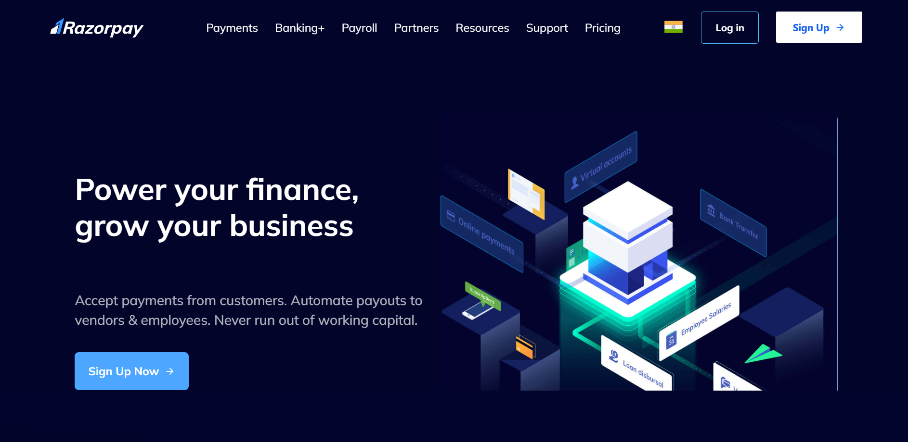
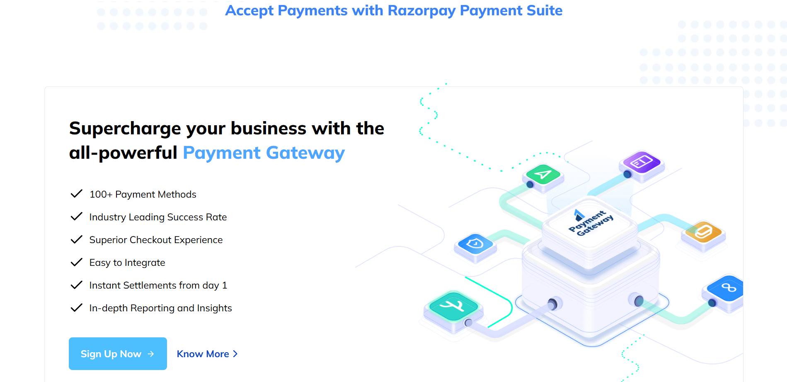
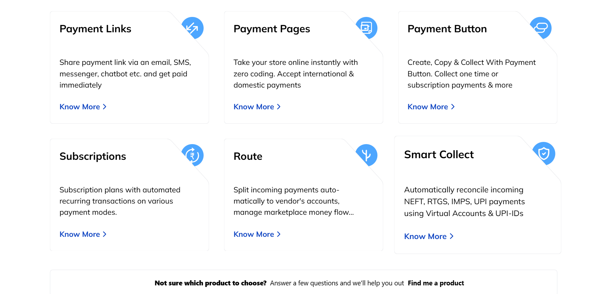
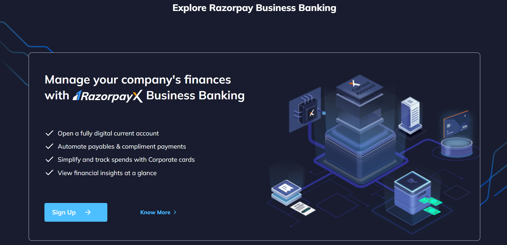
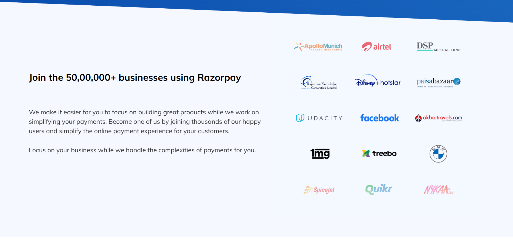
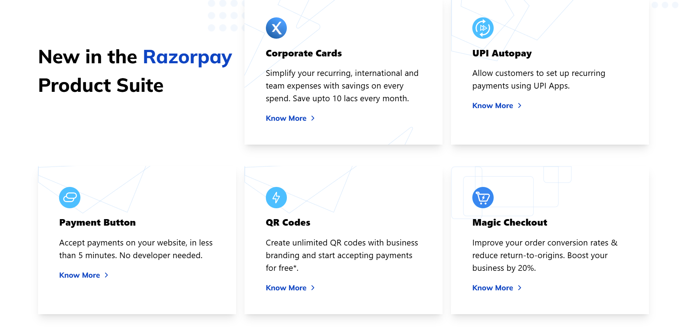
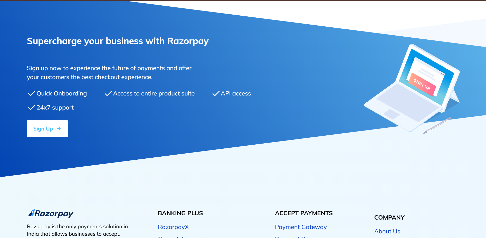

## ⭐ RazorPay Clone ⭐

It's a website that has been designed to mimic the design of the popular Indian payment gateway, Razorpay.

⭕ **This Site is Fully Responsive**
 
 
## Screenshots

### Business & Banking Page  

## Accept patments page

## Hero Sections 02 

## Hero sections 03

## Hero sections 04

## Hero sections 05

## Hero sections 06

## Hero sections 07

 

## 📌 Tech Stack

&nbsp;
&nbsp; 
 

## 📬 Connect With Me
## Ritik Roushan
## mail - ritikroushan527@gmail.com
## mob-6201354745
